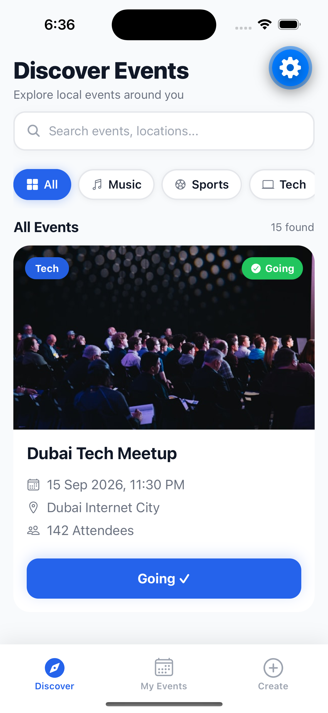
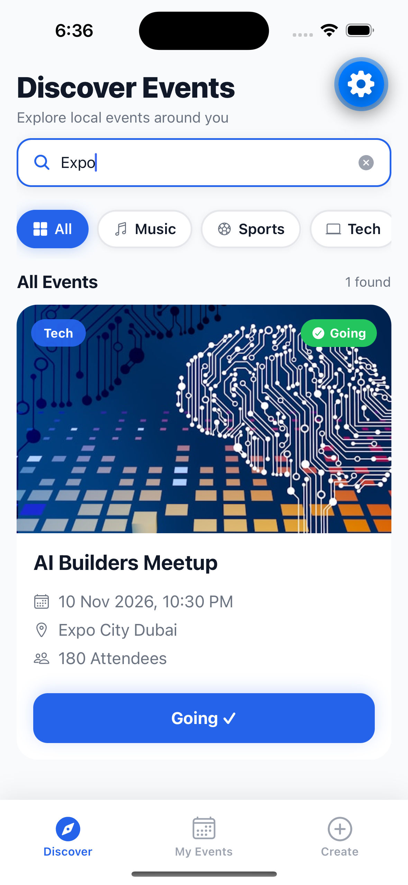
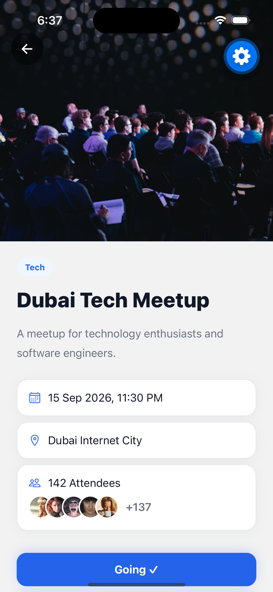
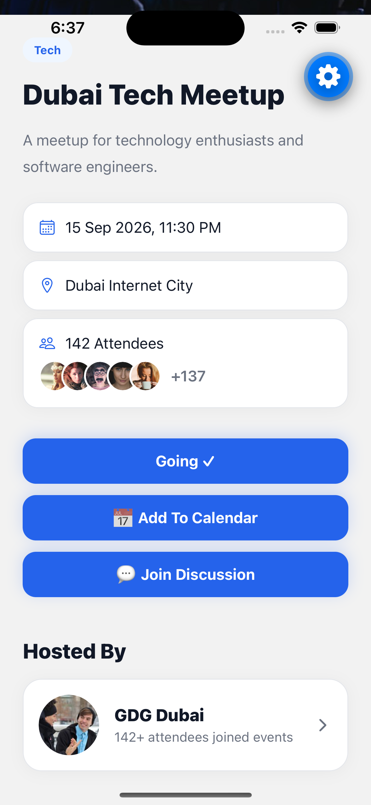
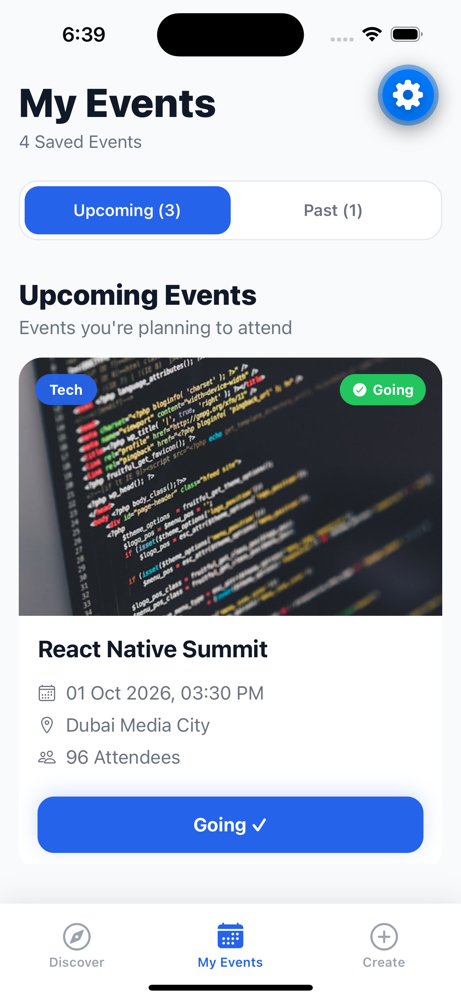
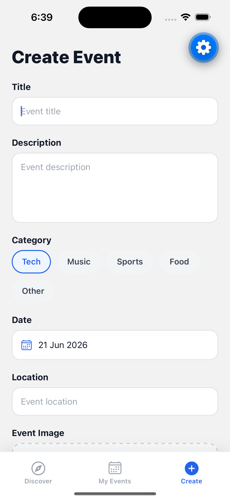
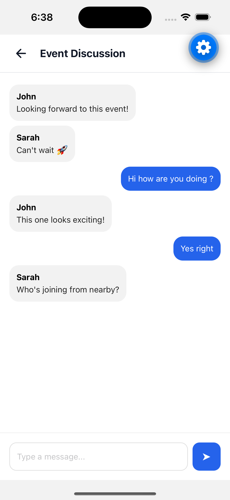
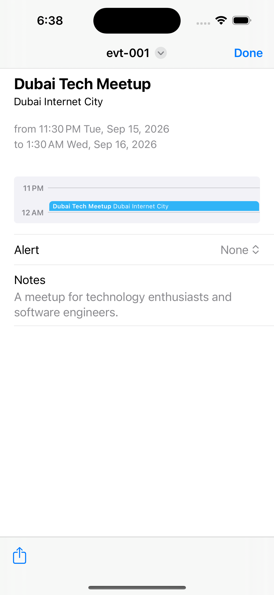
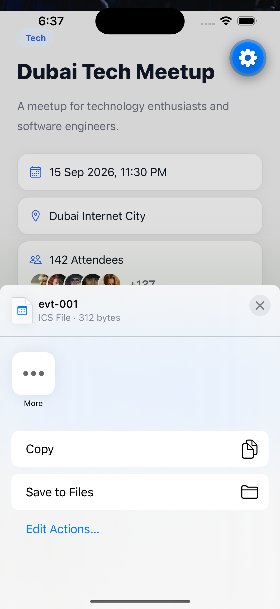

# Community Events App

A modern cross-platform Community Events application built with React Native, Expo, TypeScript, and Expo Router.

This project was developed as part of the flydubai React Native / TypeScript offline assignment.

## Features

### Discover Events

- Browse upcoming community events
- Responsive event cards
- Event cover images
- Category filtering
- Search events by title, category, or location
- Loading, empty, and error states

### Event Details

- Event cover image
- Full event description
- Date and time information
- Location information
- Attendee count
- Attendee avatar list
- RSVP functionality
- Host information
- Deep link support
- Calendar export
- Event discussion access

### My Events

- View RSVP'd events
- Upcoming events section
- Past events section
- Event statistics
- Persistent storage across app restarts

### Host Profile

- Host information
- Hosted events list
- Modern profile UI

### Event Discussion (Bonus Feature)

- Community discussion screen
- Mock chat experience
- Event-specific conversations
- Quick participant engagement

### Create Event (Bonus Feature)

- Create custom events
- Select event category
- Date picker
- Image picker integration
- Custom events persistence

### Calendar Export (Bonus Feature)

- Export events in iCal (.ics) format
- Share generated calendar files
- Import events into native calendar applications

### Search Events (Bonus Feature)

- Search by event title
- Search by location
- Search by category

---

## Tech Stack

- React Native
- Expo SDK 56
- Expo Router
- TypeScript
- Context API
- useReducer
- AsyncStorage
- Expo Image Picker
- Expo Sharing
- Expo File System
- Date-fns
- Jest
- React Native Testing Library

---

## Project Structure

```txt
app/
├── _layout.tsx
├── (tabs)
│   ├── _layout.tsx
│   ├── index.tsx
│   ├── my-events.tsx
│   └── create-event.tsx
├── event/
│   └── [id].tsx
└── host/
    └── [id].tsx

src/
├── components/
│   ├── common/
│   └── event/
├── constants/
├── context/
├── data/
├── hooks/
├── services/
├── storage/
├── types/
└── utils/
```

---

## State Management Approach

The application uses Context API combined with useReducer.

### Why Context API + useReducer?

- Built-in React solution
- No external state management libraries required
- Predictable state updates
- Easy testing
- Scales well for assignment requirements

State managed centrally includes:

- Event list
- RSVP state
- My Events
- Selected category
- Loading state
- Error state

---

## Persistence Strategy

AsyncStorage is used to persist:

- RSVP'd events
- User-created events

This ensures data remains available after application restarts.

---

## Deep Linking

### Web

```txt
/event/evt-001
```

### Native

```txt
eventsapp://event/evt-001
```

---

## Responsive Design

The application supports:

### Mobile

- Single-column event layout

### Tablet / Web

- Two-column responsive grid
- Adaptive spacing and layouts

Breakpoint:

```txt
768px+
```

---

## Testing

Implemented tests include:

### Reducer Tests

- Add RSVP event
- Remove RSVP event
- Set category
- Fetch start

Run tests:

```bash
npm jest
```

---

## Installation

Clone the repository:

```bash
git clone <repository-url>
```

Install dependencies:

```bash
npm install
```

---

## Running the App

### Start Development Server

```bash
npx expo start
```

### Android

```bash
npx expo start --android
```

### iOS

```bash
npx expo start --ios
```

### Web

```bash
npx expo start --web
```

---

## Screenshots

<table>
  <tr>
    <td align="center">
      
      <br />
      <b>Discover Events</b>
    </td>
    <td align="center">
      
      <br />
      <b>Search Events</b>
    </td>
  </tr>

  <tr>
    <td align="center">
      
      <br />
      <b>Event Details</b>
    </td>
    <td align="center">
      
      <br />
      <b>Event Actions</b>
    </td>
  </tr>

  <tr>
    <td align="center">
      
      <br />
      <b>Host Profile</b>
    </td>
    <td align="center">
      
      <br />
      <b>My Events</b>
    </td>
  </tr>

  <tr>
    <td align="center">
      
      <br />
      <b>Create Event</b>
    </td>
    <td align="center">
      
      <br />
      <b>Event Discussion</b>
    </td>
  </tr>

  <tr>
    <td align="center">
      
      <br />
      <b>Calendar Export</b>
    </td>
    <td align="center">
      
      <br />
      <b>Calendar Import</b>
    </td>
  </tr>
</table>

### Included Screens

- Discover Screen
- Event Details
- Host Profile
- My Events
- Create Event
- Search Events
- Calendar Export

---

## Technical Decisions

### Event Data

Mock event data is stored locally for predictable development and testing.

### Navigation

Expo Router was selected for:

- File-based routing
- Deep linking support
- Cleaner navigation architecture

### Persistence

AsyncStorage was chosen because:

- Lightweight
- Offline support
- Suitable for assignment scope

---

## Assignment Requirements Coverage

### Core Requirements

- Event listing
- Category filters
- RSVP toggle
- Optimistic attendee updates
- Event details screen
- Host profile screen
- My Events screen
- Persistence
- Loading states
- Empty states
- Error states
- Responsive layout
- Deep linking
- TypeScript
- Unit tests

### Bonus Features

- Create Event
- Image Picker
- Search Events
- Event Discussion
- Calendar Export

---

## Author

Debasish Das

React Native Developer
